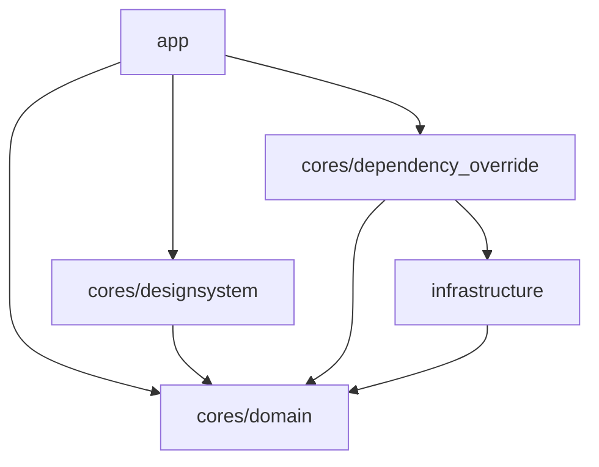

# アーキテクチャ

> [!TIP]
> 責務範囲はプロジェクトの開始時に議論するべきです。どのように分離するかはプロジェクトによって異なるためです。

## ディレクトリ構造

以下にディレクトリ構造を示します。

```text
.
├── apps
│   ├── app
│   └── catalog
│
└── packages
    ├── cores
    │   ├── dependenciy_override
    │   ├── designsystem
    │   └── domain
    │
    └── infrastructure
        ├── ...
        └── ...
```

## パッケージ

> [!IMPORTANT]
>
> - `cores/domain` はDartのみで構成され、業務ロジックを表します。
> - `cores/designsystem` は共通のデザインシステムを表します。
> - `cores/domain` パッケージは、すべてのパッケージから呼び出されます。
> - `infrastructure` のパッケージは `cores/domain` に依存し `cores/dependency_override`からのみ呼び出されます。


